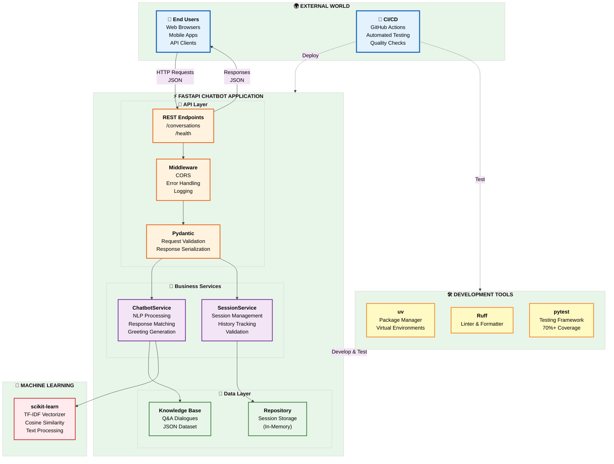
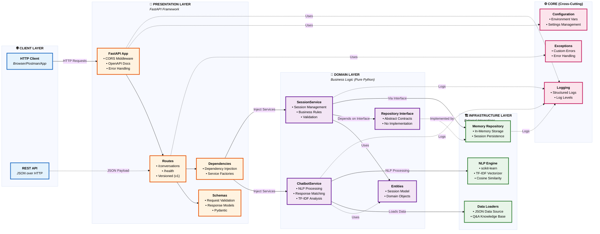

# FastAPI Chatbot

[](https://www.python.org/)
[](https://fastapi.tiangolo.com/)
[](https://github.com/psf/black)
[](https://pycqa.github.io/isort/)
[](http://mypy-lang.org/)
[](https://www.gnu.org/licenses/agpl-3.0)

> **Author:** Alyona Carolina Ivanova Araujo  
> **Email:** alenacivanovaa@gmail.com  
> **Version:** 1.0.1

A **production-ready** chatbot API built with FastAPI that leverages TF-IDF vectorization and cosine similarity for intelligent natural language processing and response generation.

## Overview

This project implements a RESTful chatbot service following **Clean Architecture** principles with comprehensive session management, structured response matching, and enterprise-grade development tooling. The application is fully containerized and includes a complete **CI/CD pipeline** for automated testing, quality assurance, and deployment.

### Why This Project Stands Out

- **Clean Architecture**: Proper separation of concerns with domain-driven design
- **Test-Driven Development**: Comprehensive unit and integration tests with 70%+ coverage
- **CI/CD Ready**: Full GitHub Actions pipeline with matrix testing
- **Modern Tooling**: uv, Ruff, Black, mypy, Bandit, pre-commit hooks
- **Production Ready**: Docker support, structured logging, environment-based configuration
- **Multilingual**: English and Norwegian support out of the box
- **Type Safe**: Full type hints with mypy static type checking

## Key Features

### Core Functionality
- **FastAPI Framework**: High-performance async REST API with automatic OpenAPI/Swagger documentation
- **NLP Engine**: TF-IDF vectorization with cosine similarity for intelligent response matching
- **Session Management**: UUID-based conversation tracking with configurable TTL
- **Multilingual Support**: English (`en`) and Norwegian (`nb`) with extensible language system
- **Confidence Scoring**: Adjustable threshold for response quality control

### Architecture & Design
- **Clean Architecture**: Domain-centric design with dependency inversion principle
- **Repository Pattern**: Abstracted data access with interface-based design
- **Dependency Injection**: Loose coupling through FastAPI's DI system
- **Factory Pattern**: Centralized object creation and lifecycle management
- **Service Layer**: Business logic isolated from HTTP and infrastructure concerns

### Development Excellence
- **Comprehensive Testing**: Unit tests, integration tests, and API endpoint tests
- **Code Coverage**: 70%+ coverage with HTML and XML reports
- **Code Formatting**: Black (88 chars) + Ruff import sorting
- **Static Analysis**: Ruff linting + mypy type checking
- **Security Scanning**: Bandit for code security analysis
- **Makefile Automation**: Streamlined development workflow commands
- **Pre-commit Hooks**: Automated quality checks before every commit

### DevOps & Deployment
- **Docker Ready**: Full containerization with docker-compose support
- **CI/CD Pipeline**: GitHub Actions with matrix testing (Python 3.11, 3.12)
- **Package Management**: Setuptools configuration with versioning
- **Configuration Management**: Environment-based settings with pydantic-settings
- **Structured Logging**: Configurable log levels and formatting
- **CORS Support**: Configurable cross-origin resource sharing

## Quick Start

Get up and running in minutes:

```bash
# 1. Clone the repository
git clone https://github.com/AlyonaCIA/FastAPI_Chatbot.git
cd FastAPI_Chatbot

# 2. Install uv (if not already installed)
curl -LsSf https://astral.sh/uv/install.sh | sh

# 3. Setup development environment (recommended)
make install-dev

# 4. Run the application
make run

# 5. Test the API
curl -X POST "http://localhost:8080/api/v1/conversations/start" \
  -H "Content-Type: application/json" \
  -d '{"language": "en"}'

# 6. View interactive documentation
open http://localhost:8080/docs
```

The API will be available at `http://localhost:8080` with:
- **Swagger UI**: `http://localhost:8080/docs`
- **ReDoc**: `http://localhost:8080/redoc`
- **OpenAPI Schema**: `http://localhost:8080/openapi.json`

## Technology Stack

### Core Framework & Runtime
- **Python 3.11/3.12**: Modern Python with latest performance improvements
- **FastAPI 0.109.0**: High-performance async web framework
- **Uvicorn 0.27.0**: Lightning-fast ASGI server
- **Pydantic 2.6.0**: Data validation and settings management with pydantic-settings

### NLP & Data Processing
- **scikit-learn 1.4.0**: TF-IDF vectorization and cosine similarity
- **cachetools 6.1.0**: Response caching for performance optimization

### Development & Quality Tools
- **uv**: Ultra-fast Python package installer and resolver (replacing pip)
- **pytest 8.0.0**: Modern Python testing framework with plugins
  - pytest-cov: Code coverage measurement
  - pytest-mock: Mock object integration
  - pytest-asyncio: Async test support
- **Black 24.1.0**: Uncompromising code formatter (88 char line length)
- **Ruff 0.3.0**: Extremely fast Python linter (replaces flake8, isort, and more)
- **mypy 1.8.0**: Static type checker for type safety
- **Bandit 1.7.0**: Security-focused static analyzer
- **pre-commit 3.6.0**: Git hook framework for automated quality checks
  - Trailing whitespace removal
  - YAML/TOML validation
  - Large file detection
  - Branch protection (dev/main)
  - Security checks
  - Typo detection

### Build & Deployment Tools
- **Makefile**: Comprehensive task automation
- **Hatchling**: Modern Python build backend
- **Docker**: Containerization for consistent deployments

## Architecture

The FastAPI Chatbot follows **Clean Architecture** principles with **Domain-Driven Design (DDD)**, ensuring clear separation of concerns, high testability, and maintainability. The architecture is organized into concentric layers where dependencies flow inward toward the domain.

### High-Level System Overview



### System Architecture



### Key Architectural Principles

1. **Dependency Rule**: Dependencies point inward. Domain layer has no dependencies on outer layers
2. **Interface Segregation**: Domain defines interfaces, Infrastructure implements them
3. **Single Responsibility**: Each layer has a specific purpose and responsibility
4. **Testability**: Pure domain logic can be tested without external dependencies
5. **Flexibility**: Infrastructure can be swapped (e.g., Memory → Database) without changing domain

### Conversation Flow Diagram

How a message flows through the system:

```mermaid
%%{init: {'theme':'base', 'themeVariables': {'fontSize':'14px'}}}%%
flowchart TD
    Start([👤 User sends message]) --> API[📡 <b>FastAPI Route</b><br/>/conversations/:id/messages]
    
    API --> Validate{<b>Validate</b><br/>Session exists?}
    Validate -->|No| Error1[❌ 404 Not Found]
    Validate -->|Yes| SessionSvc[🎯 <b>SessionService</b><br/>Add to conversation history]
    
    SessionSvc --> ChatbotSvc[🤖 <b>ChatbotService</b><br/>Process message]
    
    ChatbotSvc --> Vectorize[📊 <b>TF-IDF Vectorization</b><br/>Convert text to vectors]
    Vectorize --> Similarity[🎲 <b>Cosine Similarity</b><br/>Compare with training data]
    
    Similarity --> Threshold{<b>Confidence</b><br/>> 0.3?}
    Threshold -->|No| Fallback[💬 Fallback response<br/>"I don't understand"]
    Threshold -->|Yes| Match[✅ Best match found]
    
    Match --> SelectAnswer[🎯 <b>Select Answer</b><br/>Random from matched responses]
    Fallback --> Store
    SelectAnswer --> Store[💾 <b>Store in Session</b><br/>Update conversation history]
    
    Store --> Response([📤 Return response to user])
    
    style Start fill:#e3f2fd,stroke:#1565c0,stroke-width:3px
    style API fill:#fff3e0,stroke:#e65100,stroke-width:2px
    style SessionSvc fill:#f3e5f5,stroke:#6a1b9a,stroke-width:2px
    style ChatbotSvc fill:#f3e5f5,stroke:#6a1b9a,stroke-width:2px
    style Vectorize fill:#e8f5e9,stroke:#2e7d32,stroke-width:2px
    style Similarity fill:#e8f5e9,stroke:#2e7d32,stroke-width:2px
    style Store fill:#e8f5e9,stroke:#2e7d32,stroke-width:2px
    style Response fill:#e3f2fd,stroke:#1565c0,stroke-width:3px
    style Error1 fill:#ffebee,stroke:#c62828,stroke-width:2px
    style Fallback fill:#fff9c4,stroke:#f57f17,stroke-width:2px
    style SelectAnswer fill:#c8e6c9,stroke:#388e3c,stroke-width:2px
    style Validate fill:#fff3e0,stroke:#f57c00,stroke-width:2px
    style Threshold fill:#fff3e0,stroke:#f57c00,stroke-width:2px
    style Match fill:#c8e6c9,stroke:#388e3c,stroke-width:2px
```

### NLP Processing Pipeline

The chatbot uses scikit-learn for intelligent response matching:

```mermaid
%%{init: {'theme':'base'}}%%
graph LR
    A["<b>User Input</b><br/>'How are you?'"] --> B["<b>Preprocessing</b><br/>• Lowercase<br/>• Strip whitespace"]
    B --> C["<b>TF-IDF Vectorizer</b><br/>• n-grams (1,2)<br/>• Unicode normalization"]
    C --> D["<b>Vector Space</b><br/>Document-term matrix"]
    
    E["<b>Training Data</b><br/>Q&A Knowledge Base"] --> F["<b>Vectorization</b><br/>Pre-computed vectors"]
    F --> D
    
    D --> G["<b>Cosine Similarity</b><br/>Calculate similarity scores"]
    G --> H{"<b>Threshold</b><br/>Score > 0.3?"}
    
    H -->|Yes| I["<b>Best Match</b><br/>Highest score answer"]
    H -->|No| J["<b>Fallback</b><br/>Default response"]
    
    I --> K["<b>Response</b><br/>Return to user"]
    J --> K
    
    style A fill:#e3f2fd,stroke:#1565c0,stroke-width:3px
    style B fill:#fff3e0,stroke:#e65100,stroke-width:2px
    style C fill:#f3e5f5,stroke:#6a1b9a,stroke-width:2px
    style D fill:#e8f5e9,stroke:#2e7d32,stroke-width:2px
    style E fill:#fce4ec,stroke:#c2185b,stroke-width:2px
    style F fill:#f3e5f5,stroke:#6a1b9a,stroke-width:2px
    style G fill:#e8f5e9,stroke:#2e7d32,stroke-width:2px
    style H fill:#fff3e0,stroke:#f57c00,stroke-width:2px
    style I fill:#c8e6c9,stroke:#388e3c,stroke-width:2px
    style J fill:#ffecb3,stroke:#f57f17,stroke-width:2px
    style K fill:#e3f2fd,stroke:#1565c0,stroke-width:3px
```



### Project Structure

Detailed view of the project organization:

```
app/
├── main.py                     # Application entry point
├── core/                       # Application configuration and utilities
│   ├── config.py               # Centralized settings management
│   ├── exceptions.py           # Custom exception definitions
│   └── logging.py              # Logging configuration
├── api/                        # HTTP layer (FastAPI routes and schemas)
│   ├── dependencies.py         # Dependency injection setup
│   └── v1/                     # API versioning
│       ├── routes/             # HTTP endpoints
│       │   ├── conversation.py # Conversation management endpoints
│       │   └── health.py       # Health check endpoints
│       └── schemas/            # Request/response models
│           ├── conversation.py # Conversation-related schemas
│           └── common.py       # Shared schemas
├── domain/                     # Business logic layer
│   ├── entities/               # Domain objects
│   │   └── session.py          # Session entity
│   ├── repositories/           # Repository interfaces
│   │   └── session.py          # Session repository interface
│   └── services/               # Business logic services
│       ├── chatbot.py          # Core chatbot logic
│       └── session.py          # Session management service
└── infrastructure/             # External concerns layer
    ├── data/                   # Data access and loading
    │   ├── datasets/           # Training data
    │   │   └── data-bot.json # Chatbot conversation data
    │   └── loaders/            # Data loading utilities
    │       └── chatbot_data.py # JSON data loader
    └── repositories/           # Repository implementations
        └── memory/             # In-memory implementations
            └── session.py      # In-memory session repository
```

### Design Patterns & Architectural Principles

#### 1. Clean Architecture (Hexagonal Architecture)
The project follows the **Dependency Rule**: dependencies point inward toward the domain layer.

- **Domain Layer** (Core): Contains business logic, entities, and interfaces - has no external dependencies
- **Application Layer** (API): Orchestrates use cases and handles HTTP concerns
- **Infrastructure Layer**: Implements interfaces defined by the domain (repositories, data loaders, NLP)
- **Core Layer**: Cross-cutting concerns (config, logging, exceptions)

**Benefits**: Testable, maintainable, framework-independent business logic.

#### 2. Repository Pattern
Abstracts data access through interfaces, allowing easy swapping of storage implementations.

```python
# Domain defines the contract
class SessionRepositoryInterface(ABC):
    @abstractmethod
    def create_session(self, language: str) -> str: ...
    
# Infrastructure provides implementations
class InMemorySessionRepository(SessionRepositoryInterface):
    def create_session(self, language: str) -> str:
        # Implementation details
```

**Current**: In-memory storage  
**Future**: Can easily add PostgreSQL, Redis, or MongoDB implementations without changing business logic.

#### 3. Dependency Injection (DI)
FastAPI's DI system provides loose coupling and testability.

```python
# Dependencies module acts as a Service Locator
def get_session_service(
    repo: SessionRepositoryInterface = Depends(get_session_repository)
) -> SessionService:
    return SessionService(repo)

# Routes receive dependencies automatically
@router.post("/start")
async def start_conversation(
    session_service: SessionService = Depends(get_session_service)
):
    # Use service without knowing implementation details
```

**Benefits**: Easy mocking for tests, singleton management, clear dependencies.

#### 4. Service Layer Pattern
Encapsulates business logic separate from HTTP/infrastructure concerns.

- **ChatbotService**: NLP processing, response generation, confidence scoring
- **SessionService**: Session validation, history management, language rules

**Benefits**: Business logic reusable across different interfaces (REST, GraphQL, CLI).

#### 5. Strategy Pattern (implicit)
Different NLP strategies can be plugged in (currently TF-IDF, future: transformers, LLMs).

#### 6. Factory Pattern
Centralized object creation in [dependencies.py](app/api/dependencies.py) manages lifecycles and ensures singletons.

### Layer Responsibilities

| Layer | Responsibility | Examples |
|-------|----------------|----------|
| **API** | HTTP handling, validation, serialization | Routes, Pydantic schemas |
| **Domain** | Business rules, core logic | Services, entities, interfaces |
| **Infrastructure** | External systems, I/O | Repositories, data loaders, NLP |
| **Core** | Cross-cutting concerns | Config, logging, exceptions |

### Key Architectural Decisions

1. **Stateless API**: Sessions stored server-side, identified by UUID
2. **In-Memory Storage**: Fast prototyping; easily replaced with persistent storage
3. **TF-IDF NLP**: Lightweight, no external API dependencies, good for FAQ-style conversations
4. **Pydantic Models**: Type safety, automatic validation, OpenAPI documentation
5. **Async/Await**: Non-blocking I/O for scalability (ready for database operations)

## API Endpoints

### Start Conversation
```http
POST /api/v1/conversations/start
Content-Type: application/json

{
  "language": "en"
}
```

**Response:**
```json
{
  "session_id": "uuid-string",
  "message": "Hello! I am a chatbot!",
  "success": true
}
```

### Send Message
```http
POST /api/v1/conversations/{session_id}/messages
Content-Type: application/json

{
  "message": "Hello, how are you?"
}
```

**Response:**
```json
{
  "session_id": "uuid-string",
  "message": "I am fine, thank you for asking! What can I do for you today?",
  "success": true
}
```

### Health Check
```http
GET /api/v1/health
```

### Debug Sessions
```http
GET /api/v1/conversations/debug/sessions
```

## Installation

### Prerequisites

Ensure you have the following installed:
- **Python 3.11 or 3.12** (3.12 recommended for latest features)
- **uv** - Ultra-fast Python package manager ([installation guide](https://github.com/astral-sh/uv))
- **git** for cloning the repository
- **(Optional) Docker** for containerized deployment

### Local Development Setup

#### Option 1: Quick Setup with Makefile (Recommended)

```bash
# Clone the repository
git clone https://github.com/AlyonaCIA/FastAPI_Chatbot.git
cd FastAPI_Chatbot

# Install uv if not already installed
curl -LsSf https://astral.sh/uv/install.sh | sh

# Install all dependencies (including dev tools)
make install-dev

# Run the application
make run

# Or run in development mode with auto-reload
make dev
```

#### Option 2: Manual Setup with uv

```bash
# 1. Clone the repository
git clone https://github.com/AlyonaCIA/FastAPI_Chatbot.git
cd FastAPI_Chatbot

# 2. Install uv (if not already installed)
curl -LsSf https://astral.sh/uv/install.sh | sh

# 3. Create virtual environment with uv
uv venv

# 4. Activate virtual environment
source .venv/bin/activate  # Linux/macOS
# or
.venv\Scripts\activate  # Windows

# 5. Install production dependencies
uv pip install -e .

# 6. Install development dependencies (for contributors)
uv pip install -e ".[dev]"

# 7. Install pre-commit hooks (optional but recommended)
pre-commit install

# 8. Verify installation
pytest tests/
```

### Environment Configuration

Copy the example environment file and customize as needed:

```bash
# Copy example file
cp .env.example .env

# Edit with your preferred editor
nano .env
```

Example `.env` configuration:
```bash
# Application Settings
DEBUG=false
LOG_LEVEL=INFO

# Server Configuration
HOST=0.0.0.0
PORT=8080

# Chatbot Settings
DEFAULT_LANGUAGE=en
CONFIDENCE_THRESHOLD=0.3
SESSION_TTL_HOURS=24
MAX_SESSIONS=1000
```

### Running the Application

```bash
# Using Makefile (recommended)
make run              # Production mode
make dev              # Development mode with auto-reload

# Direct execution
python -m app.main

# Or with uvicorn directly
uvicorn app.main:app --reload --host 0.0.0.0 --port 8080

# Production mode
uvicorn app.main:app --host 0.0.0.0 --port 8080 --workers 4
```

Access the API:
- **API Base**: http://localhost:8080
- **Swagger Docs**: http://localhost:8080/docs
- **ReDoc**: http://localhost:8080/redoc

### Docker Deployment

For containerized deployment:

```bash
# Build Docker image
docker build -t fastapi-chatbot:latest .

# Run container
docker run -d \
  --name fastapi-chatbot \
  -p 8080:8080 \
  -e DEBUG=false \
  -e LOG_LEVEL=INFO \
  fastapi-chatbot:latest

# View logs
docker logs -f fastapi-chatbot

# Stop container
docker stop fastapi-chatbot

# Or use docker-compose
docker-compose up -d --build

# View docker-compose logs
docker-compose logs -f
```

**Docker Features:**
- Production-ready multi-stage build
- Minimal image size with alpine base
- Non-root user for security
- Health checks included
- Structured logging to stdout

## Development

### Quick Development Commands

The project includes a comprehensive Makefile for common development tasks:

```bash
# See all available commands
make help

# Setup and Installation
make install          # Install production dependencies
make install-dev      # Install all dependencies including dev tools
make sync             # Sync dependencies from lock file
make update           # Update dependencies to latest versions

# Code Quality
make format           # Format code with black and ruff
make lint             # Run ruff linter
make type-check       # Run mypy type checking
make security         # Run bandit security checks
make pre-commit       # Run all pre-commit hooks

# Testing
make test             # Run all tests
make test-cov         # Run tests with coverage report

# CI/CD
make ci               # Run full CI pipeline locally

# Running
make run              # Run application
make dev              # Run in development mode with auto-reload

# Cleanup
make clean            # Remove build artifacts and cache files
```

### Using Makefile (Recommended Workflow)

```bash
# Initial setup
make install-dev

# Development cycle
make format           # Format your code
make lint             # Check for issues
make test             # Run tests
make type-check       # Verify types

# Before committing
make ci               # Run full pipeline locally
```

### Pre-commit Hooks

Install pre-commit hooks to automatically enforce code quality standards:

```bash
# Install hooks (one-time setup)
pre-commit install

# Manually run hooks on all files
pre-commit run --all-files

# Update hook versions
pre-commit autoupdate
```

**Pre-commit checks include:**
- Trailing whitespace removal
- End-of-file fixer
- YAML syntax validation
- Large file detection (>500KB)
- Branch protection (prevents commits to dev/main)
- Docstring formatting (88 char wrap)
- Import sorting (isort)
- Code linting (flake8)
- Typo detection

## Testing

### Running Tests

```bash
# Run all tests
pytest

# Run specific test types
pytest tests/unit/           # Unit tests only
pytest tests/integration/    # Integration tests only

# Run with coverage
pytest --cov=app --cov-report=html

# Run with uv
uv run pytest tests/
```

### Test Structure

```
tests/
├── unit/                    # Unit tests
│   ├── domain/              # Domain layer tests
│   └── infrastructure/      # Infrastructure layer tests
├── integration/             # Integration tests
│   └── api/                 # API endpoint tests
└── conftest.py             # Pytest configuration and fixtures
```

## Configuration

The application uses environment variables for configuration:

```bash
# Create .env file (optional)
DEBUG=true
LOG_LEVEL=INFO
HOST=0.0.0.0
PORT=8080
DEFAULT_LANGUAGE=en
CONFIDENCE_THRESHOLD=0.3
SESSION_TTL_HOURS=24
```

### Configuration Options

- `DEBUG`: Enable debug mode (default: false)
- `LOG_LEVEL`: Logging level (default: INFO)
- `HOST`: Server host (default: 0.0.0.0)
- `PORT`: Server port (default: 8080)
- `DEFAULT_LANGUAGE`: Default conversation language (default: en)
- `CONFIDENCE_THRESHOLD`: NLP confidence threshold (default: 0.3)
- `SESSION_TTL_HOURS`: Session time-to-live (default: 24)

## CI/CD Pipeline

The project includes a comprehensive GitHub Actions workflow that ensures code quality and reliability.

### Pipeline Architecture

```
┌─────────────────────────────────────────────────────────────┐
│                    GitHub Actions Pipeline                   │
├─────────────────────────────────────────────────────────────┤
│                                                              │
│  ┌──────────────┐  ┌──────────────┐  ┌─────────────────┐  │
│  │ Code Quality │  │    Testing    │  │  Build & Deploy │  │
│  ├──────────────┤  ├──────────────┤  ├─────────────────┤  │
│  │ • Format ✓   │  │ • Python 3.11│  │ • Package Build │  │
│  │ • Lint ✓     │  │ • Python 3.12│  │ • Docker Image  │  │
│  │ • Type Check │  │ • Coverage   │  │ • Artifacts     │  │
│  │ • Security   │  │ • JUnit XML  │  │ • Reports       │  │
│  └──────────────┘  └──────────────┘  └─────────────────┘  │
│                                                              │
└─────────────────────────────────────────────────────────────┘
```

### CI/CD Jobs

#### 1. **Code Quality & Security**
- **Black & isort**: Code formatting validation
- **flake8**: PEP 8 compliance and linting
- **mypy**: Static type checking
- **Safety**: Dependency vulnerability scanning
- **Exit on failure**: Pipeline stops if quality checks fail

#### 2. **Matrix Testing**
- **Python Versions**: 3.11, 3.12
- **Parallel Execution**: Tests run simultaneously
- **Coverage Reports**: HTML, XML, and terminal output
- **JUnit XML**: Test result artifacts for analysis
- **Minimum Coverage**: 70% threshold enforced

#### 3. **GitHub Actions Validation**
- **Automated CI/CD**: Runs on every PR and push to main
- **Full Pipeline**: format → lint → test → security
- **Dependency Caching**: Faster builds with uv cache
- **Artifact Upload**: Coverage reports and test results

#### 4. **Integration Testing**
- **API Workflow**: Real conversation flow testing
- **Session Management**: UUID tracking validation
- **Multi-language**: English and Norwegian responses
- **Health Checks**: Endpoint availability verification

#### 5. **Build Verification**
- **Setup.py**: Package building and installation
- **Dependency Resolution**: Requirements validation
- **Import Testing**: Module accessibility checks

### Trigger Conditions

The pipeline runs automatically on:
- **Push** to `main`, `develop`, or `feature/*` branches
- **Pull Requests** targeting `main` or `develop`
- **Manual Dispatch**: Workflow can be triggered manually

### Caching Strategy

Optimized build times through intelligent caching:
- **uv Cache**: Python packages cached per version
- **GitHub Actions**: Workflow caching per commit
- **Cache Key**: Based on pyproject.toml hash

### Artifacts & Reports

Generated artifacts include:
- **Test Results**: JUnit XML format
- **Coverage Reports**: HTML and XML
- **Security Scan**: JSON vulnerability report
- **Retention**: 30 days for all artifacts

## NLP and Chatbot Logic

### Response Selection Algorithm

1. **Greeting Detection**: Checks for common greetings (hello, hi, hey)
2. **Sample Matching**: Uses TF-IDF vectorization and cosine similarity
3. **Keyword Matching**: Falls back to keyword-based responses
4. **Fallback Response**: Default response for unmatched inputs

### Training Data

The chatbot uses structured JSON data (`chatbot-data.json`) with:
- **Greetings**: Welcome messages in multiple languages
- **Dialogues**: Sample-based conversations with replies
- **Keywords**: Topic-based responses
- **Fallbacks**: Default responses for unknown inputs

### Multilingual Support

- English (`en`) and Norwegian (`nb`) support
- Language-specific responses and greetings
- Automatic language detection and validation

## Contributing

We welcome contributions from the community! Please follow these guidelines to ensure a smooth collaboration.

### Development Guidelines

1. **Follow Clean Architecture**: Maintain separation between domain, infrastructure, and API layers
2. **Write Tests First**: TDD approach - write tests before implementing features
3. **Maintain Coverage**: Keep code coverage above 70%
4. **Type Everything**: Use type hints for all function parameters and return values
5. **Document Code**: Add docstrings to all classes and public methods
6. **Conventional Commits**: Use clear, descriptive commit messages
7. **Run Quality Checks**: Ensure all CI checks pass before submitting PR

### Contribution Workflow

```bash
# 1. Fork the repository on GitHub
# 2. Clone your fork
git clone https://github.com/YOUR_USERNAME/FastAPI_Chatbot.git
cd FastAPI_Chatbot

# 3. Create a feature branch from main
git checkout main
git pull origin main
git checkout -b feature##/your-feature-name

# 4. Install development dependencies
./run_local.sh -i

# 5. Install pre-commit hooks
pre-commit install

# 6. Make your changes following TDD
# - Write tests first (tests/)
# - Implement feature
# - Run tests: make test

# 7. Run all quality checks locally
make ci
# or use individual commands
make format lint type-check test-cov security

# 8. Commit with conventional commit message
git add .
git commit -m "feat: add new feature description"

# 9. Push to your fork
git push origin feature##/your-feature-name

# 10. Open a Pull Request on GitHub
# - Target branch: main
# - Fill out PR template
# - Wait for CI to pass
# - Request review
```

### Branch Naming Convention

Follow the repository's naming pattern:
- `feature##/description` - New features (e.g., `feature04/add-dual-license`)
- `bugfix##/description` - Bug fixes
- `docs##/description` - Documentation updates
- `refactor##/description` - Code refactoring

### Commit Message Format

Use conventional commits for clear history:
```
<type>(<scope>): <description>

[optional body]

[optional footer]
```

**Types:**
- `feat`: New feature
- `fix`: Bug fix
- `docs`: Documentation changes
- `style`: Code style changes (formatting, etc.)
- `refactor`: Code refactoring
- `test`: Adding or updating tests
- `chore`: Maintenance tasks

**Examples:**
```bash
feat(api): add conversation history endpoint
fix(chatbot): resolve TF-IDF vectorization edge case
docs(readme): update installation instructions
test(domain): add session service unit tests
```

### Code Standards

#### Python Style
- **Line Length**: 88 characters (Black default)
- **Import Sorting**: isort with black profile
- **Docstring Style**: Google-style docstrings
- **Naming Conventions**:
  - Classes: `PascalCase`
  - Functions/Variables: `snake_case`
  - Constants: `UPPER_SNAKE_CASE`
  - Private members: `_leading_underscore`

#### Type Hints
```python
from typing import List, Optional, Dict

def process_message(
    message: str,
    session_id: str,
    metadata: Optional[Dict[str, str]] = None
) -> List[str]:
    """Process incoming message."""
    pass
```

#### Testing Requirements
- Unit tests for all business logic
- Integration tests for API endpoints
- Minimum 70% code coverage
- Test file naming: `test_*.py`
- Test function naming: `test_<feature>_<scenario>()`

### Pull Request Checklist

Before submitting, ensure:
- [ ] Code follows project style guide
- [ ] All tests pass (`make test`)
- [ ] Code coverage is maintained or improved
- [ ] Type checking passes (`make type-check`)
- [ ] Security scan passes (`make security`)
- [ ] Documentation is updated (if needed)
- [ ] Commit messages follow conventional format
- [ ] Branch is up to date with main
- [ ] No conflicts with main branch

### Getting Help

- **Email**: alenacivanovaa@gmail.com
- **Documentation**: Check `/docs` folder
- **Bug Reports**: Open an issue with detailed description
- **Feature Requests**: Open an issue with use case explanation

## Performance Considerations

- **Singleton Pattern**: Services are instantiated once per application lifecycle
- **Caching**: TF-IDF vectors are pre-computed and cached
- **Session Management**: Efficient in-memory storage with TTL cleanup
- **Async Support**: Full async/await implementation for scalability
- **Connection Pooling**: Optimized for database connections (future enhancement)

## Security

- **Input Validation**: Pydantic models validate all inputs
- **Dependency Scanning**: Automated security vulnerability checks
- **CORS Configuration**: Configurable cross-origin resource sharing
- **Environment Variables**: Sensitive configuration externalized

## License

**Copyright © 2024-2026 Alyona Carolina Ivanova Araujo**

This project is available under a **dual licensing model** to support both open-source community and commercial use:

### Free License: AGPL-3.0

The following users can use this software **FREE** under the GNU Affero General Public License v3.0:

| User Type | Use Case | Cost |
|-----------|----------|------|
| **Individual Developers** | Personal projects, learning, portfolio | **FREE** |
| **Educational Institutions** | Universities, schools, research, teaching | **FREE** |
| **Students & Researchers** | Academic projects, thesis work | **FREE** |
| **Non-Profit Organizations** | Charitable work, community projects | **FREE** |
| **Open Source Projects** | AGPL-compatible projects, contributions | **FREE** |

**Requirements:**
- Source code modifications must be disclosed
- Derivative works must use AGPL-3.0
- Network use triggers copyleft (AGPL provision)
- Attribution to original author required

### Commercial License

**For-profit companies** and commercial entities must obtain a commercial license:

| User Type | When Required |
|-----------|---------------|
| **Companies** | Using software in any commercial capacity |
| **For-Profit Orgs** | Revenue-generating products or services |
| **SaaS Providers** | Hosting as a service for customers |
| **Product Integration** | Embedding in proprietary software |

**Benefits:**
- No source code disclosure required
- No copyleft obligations
- Proprietary use allowed
- Priority support & maintenance
- Custom feature development available
- Legal protection & indemnification

**To obtain a commercial license:**
- Email: alenacivanovaa@gmail.com
- Subject: "FastAPI Chatbot - Commercial License Request"
- Include: Company name, use case, number of developers

### Licensing FAQ

**Q: I'm a freelancer building a client project. Which license?**  
A: If your client is a commercial entity, they need a commercial license. If you're doing non-profit work, AGPL-3.0 applies.

**Q: Can I use this for my startup?**  
A: If your startup is a registered business or generating revenue, you need a commercial license.

**Q: What if I modify the code?**  
A: Under AGPL-3.0, you must share modifications. Under commercial license, modifications are proprietary.

**Q: University spin-off company?**  
A: Company = Commercial license. University research project = AGPL-3.0.

For complete legal terms, see the [LICENSE](LICENSE) file.

**Questions?** Contact: alenacivanovaa@gmail.com

---

## Author

<div align="center">

### Alyona Carolina Ivanova Araujo

**Software Engineer | Python Developer | API Architect**

**Email:** alenacivanovaa@gmail.com  
**GitHub:** [@AlyonaCIA](https://github.com/AlyonaCIA)  
**Version:** 1.0.1

---

### Project Stats


</div>

---

## Acknowledgments

This project was built with:
- Modern Python best practices and tooling
- Clean Architecture principles
- Test-Driven Development methodology
- Comprehensive CI/CD pipeline
- Community-driven open source values

---

<div align="center">

**If you find this project useful, please consider giving it a star!**

Made with care by Alyona Carolina Ivanova Araujo

</div>
